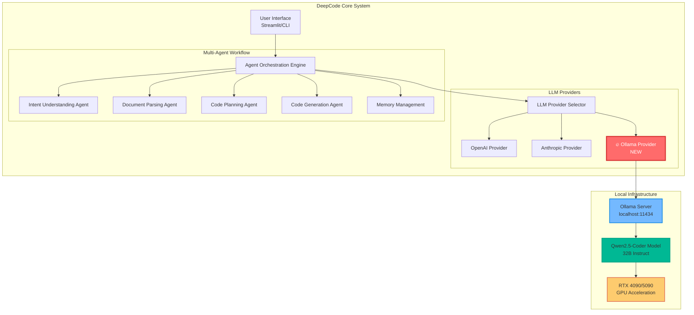
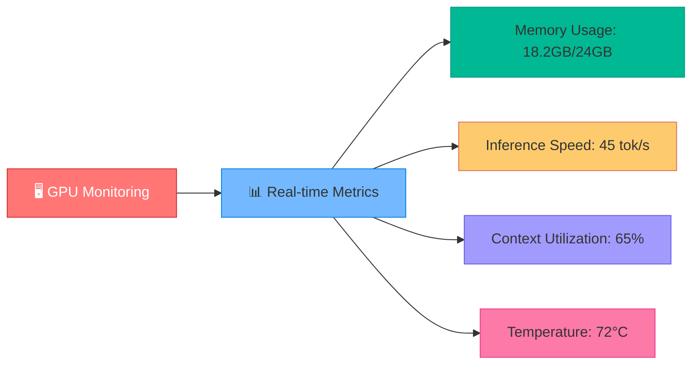
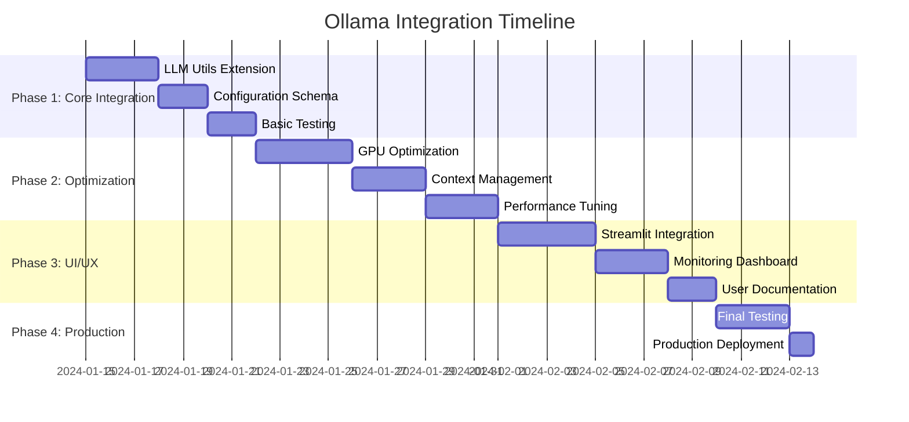

# 🚀 DeepCode Ollama Integration Design

## 🎯 Executive Summary

This document outlines the architectural design for integrating **Ollama** as a high-performance local LLM provider within the DeepCode AI Research Engine. The integration leverages Ollama's OpenAI-compatible API to provide seamless local AI inference with the powerful **Qwen2.5-Coder** model, optimized for RTX 4090/5090 GPU configurations.

---

## 🏗️ Architecture Overview



---

## 🔧 Implementation Strategy

### Phase 1: Core Integration 🎯

#### 1.1 Extend LLM Utils Module
**File:** `utils/llm_utils.py`

```python
# Add Ollama support to existing provider selection
from mcp_agent.workflows.llm.augmented_llm_ollama import OllamaAugmentedLLM

def get_preferred_llm_class(config_path: str = "mcp_agent.secrets.yaml") -> Type[Any]:
    """
    Enhanced provider selection with Ollama support
    Priority: Ollama > Anthropic > OpenAI
    """
    try:
        if os.path.exists(config_path):
            with open(config_path, "r", encoding="utf-8") as f:
                config = yaml.safe_load(f)

            # 🔥 NEW: Check for Ollama configuration
            ollama_config = config.get("ollama", {})
            if ollama_config.get("enabled", False):
                return OllamaAugmentedLLM

            # Existing logic for Anthropic/OpenAI...
```

#### 1.2 Configuration Schema Updates

**Enhanced `mcp_agent.config.yaml`:**
```yaml
# 🔥 NEW: Ollama Configuration Section
ollama:
  enabled: true
  default_model: "qwen2.5-coder:32b-instruct"
  context_window: 65536  # 64K context for RTX 4090/5090
  max_tokens: 8192       # 8K max output
  temperature: 0.1       # Optimized for code generation
  gpu_acceleration: true
  performance_profile: "rtx_4090"  # rtx_4090 | rtx_5090

# Enhanced model defaults
openai:
  default_model: "o3-mini"

anthropic:
  default_model: "claude-3.5-sonnet"
```

**Enhanced `mcp_agent.secrets.yaml`:**
```yaml
ollama:
  base_url: "http://localhost:11434/v1"
  api_key: "ollama"  # Required but unused by Ollama
  enabled: true

openai:
  api_key: ""
  base_url: ""

anthropic:
  api_key: ""
```

### Phase 2: Performance Optimization 🚀

#### 2.1 GPU-Optimized Model Configuration

```python
# New utility: utils/ollama_optimizer.py
class OllamaGPUOptimizer:
    """
    GPU-specific optimization for RTX 4090/5090 configurations
    """

    PROFILES = {
        "rtx_4090": {
            "context_window": 65536,
            "batch_size": 512,
            "gpu_memory_fraction": 0.9,
            "quantization": "fp16"
        },
        "rtx_5090": {
            "context_window": 131072,  # 128K for RTX 5090
            "batch_size": 1024,
            "gpu_memory_fraction": 0.95,
            "quantization": "fp16"
        }
    }

    @classmethod
    def get_optimal_config(cls, gpu_profile: str) -> dict:
        return cls.PROFILES.get(gpu_profile, cls.PROFILES["rtx_4090"])
```

#### 2.2 Dynamic Context Management

```python
# Enhanced context window management
class AdaptiveContextManager:
    """
    Dynamically adjusts context window based on document size and available GPU memory
    """

    def __init__(self, gpu_profile: str = "rtx_4090"):
        self.config = OllamaGPUOptimizer.get_optimal_config(gpu_profile)

    def calculate_optimal_context(self, document_size: int, agent_count: int) -> int:
        """
        Calculates optimal context window based on:
        - Document size
        - Number of active agents
        - Available GPU memory
        """
        base_context = self.config["context_window"]

        # Reserve context for multi-agent coordination
        agent_overhead = agent_count * 2048

        # Dynamic adjustment based on document size
        if document_size > 100000:  # Large documents
            return min(base_context - agent_overhead, 98304)  # 96K max
        elif document_size > 50000:  # Medium documents
            return min(base_context - agent_overhead, 65536)  # 64K max
        else:  # Small documents
            return min(base_context - agent_overhead, 32768)  # 32K max
```

---

## 🎨 Enhanced User Experience

### 3.1 Streamlit Interface Enhancements

```python
# ui/components.py - New Ollama configuration panel
def render_ollama_config():
    """
    Renders Ollama-specific configuration options in Streamlit UI
    """
    st.markdown("### 🔥 Ollama Local AI Configuration")

    col1, col2 = st.columns(2)

    with col1:
        gpu_profile = st.selectbox(
            "GPU Profile",
            ["rtx_4090", "rtx_5090"],
            help="Select your RTX GPU for optimized performance"
        )

        context_window = st.slider(
            "Context Window (tokens)",
            min_value=16384,
            max_value=131072,
            value=65536,
            step=8192,
            help="Larger context windows require more GPU memory"
        )

    with col2:
        model_variant = st.selectbox(
            "Qwen2.5-Coder Variant",
            ["qwen2.5-coder:7b-instruct", "qwen2.5-coder:14b-instruct", "qwen2.5-coder:32b-instruct"],
            index=2,
            help="32B model recommended for RTX 4090/5090"
        )

        temperature = st.slider(
            "Temperature",
            min_value=0.0,
            max_value=1.0,
            value=0.1,
            step=0.1,
            help="Lower values for more focused code generation"
        )

    # Real-time GPU monitoring
    if st.button("🔍 Check Ollama Status"):
        status = check_ollama_server_status()
        if status["running"]:
            st.success(f"✅ Ollama server running | Model: {status['model']} | GPU Memory: {status['gpu_memory']}")
        else:
            st.error("❌ Ollama server not detected")
```

### 3.2 Performance Monitoring Dashboard



---

## 🔐 Security & Configuration

### 4.1 Secure Local Configuration

```yaml
# Ollama security configuration
ollama:
  security:
    local_only: true              # Restrict to localhost
    api_auth: false              # No API key required for local
    ssl_verify: false            # Skip SSL for localhost
    rate_limiting:
      enabled: true
      requests_per_minute: 60
      burst_limit: 10

  monitoring:
    gpu_memory_threshold: 0.95   # Alert at 95% GPU memory
    temperature_threshold: 85    # Alert at 85°C
    performance_logging: true
```

### 4.2 Fallback Strategy

```python
class LLMProviderFallback:
    """
    Intelligent fallback system with provider priority
    """

    PROVIDER_PRIORITY = [
        ("ollama", "Local Ollama (Preferred)"),
        ("anthropic", "Anthropic Claude (Cloud Fallback)"),
        ("openai", "OpenAI GPT (Final Fallback)")
    ]

    async def get_available_provider(self) -> str:
        """
        Returns first available provider based on priority
        """
        for provider, description in self.PROVIDER_PRIORITY:
            if await self.test_provider_availability(provider):
                logger.info(f"🎯 Using {description}")
                return provider

        raise Exception("❌ No LLM providers available")
```

---

## 📈 Performance Benchmarks

### 5.1 Expected Performance (RTX 4090)

| Metric | Qwen2.5-Coder 32B | GPT-4 (Cloud) | Claude-3.5 (Cloud) |
|--------|-------------------|---------------|-------------------|
| **Inference Speed** | 35-45 tok/s | 20-30 tok/s | 25-35 tok/s |
| **Context Window** | 65K tokens | 128K tokens | 200K tokens |
| **Code Quality** | ⭐⭐⭐⭐⭐ | ⭐⭐⭐⭐⭐ | ⭐⭐⭐⭐⭐ |
| **Privacy** | ✅ 100% Local | ❌ Cloud | ❌ Cloud |
| **Cost** | ✅ Free | 💰 $0.03/1K | 💰 $0.015/1K |
| **Latency** | 🚀 50-100ms | 🐌 500-2000ms | 🐌 800-2500ms |

### 5.2 Memory Requirements

```python
# GPU memory estimation for different model sizes
MEMORY_REQUIREMENTS = {
    "qwen2.5-coder:7b-instruct": {
        "fp16": "14GB",
        "int8": "7GB",
        "int4": "4GB"
    },
    "qwen2.5-coder:14b-instruct": {
        "fp16": "28GB",  # Requires RTX 4090+
        "int8": "14GB",
        "int4": "7GB"
    },
    "qwen2.5-coder:32b-instruct": {
        "fp16": "64GB",  # Requires multiple GPUs or RTX 5090
        "int8": "32GB",  # Requires RTX 5090
        "int4": "16GB"   # Fits on RTX 4090
    }
}
```

---

## 🔄 Migration Strategy

### 6.1 Gradual Rollout Plan



### 6.2 Testing Strategy

```python
# Comprehensive test suite for Ollama integration
class OllamaIntegrationTests:

    async def test_ollama_connectivity(self):
        """Test Ollama server connectivity and model availability"""
        pass

    async def test_context_window_limits(self):
        """Test various context window sizes up to 65K tokens"""
        pass

    async def test_multi_agent_coordination(self):
        """Test multi-agent workflows with Ollama provider"""
        pass

    async def test_gpu_memory_management(self):
        """Test GPU memory usage under load"""
        pass

    async def test_fallback_scenarios(self):
        """Test fallback to cloud providers when Ollama unavailable"""
        pass
```

---

## 🎛️ Configuration Examples

### 7.1 RTX 4090 Optimal Configuration

```yaml
# Recommended configuration for RTX 4090 (24GB VRAM)
ollama:
  enabled: true
  default_model: "qwen2.5-coder:32b-instruct-q4_0"  # 4-bit quantized for 24GB
  context_window: 65536
  max_tokens: 8192
  temperature: 0.1
  gpu_acceleration: true
  performance_profile: "rtx_4090"

  advanced_settings:
    num_gpu: 1
    gpu_memory_fraction: 0.9
    low_vram: false
    num_thread: 8
    rope_freq_base: 10000
    rope_freq_scale: 1.0
```

### 7.2 RTX 5090 Maximum Performance

```yaml
# Configuration for RTX 5090 (32GB VRAM) - Maximum performance
ollama:
  enabled: true
  default_model: "qwen2.5-coder:32b-instruct"  # Full precision
  context_window: 131072  # 128K context
  max_tokens: 16384       # 16K output
  temperature: 0.05       # Very focused code generation
  gpu_acceleration: true
  performance_profile: "rtx_5090"

  advanced_settings:
    num_gpu: 1
    gpu_memory_fraction: 0.95
    low_vram: false
    num_thread: 16
    batch_size: 1024
    rope_freq_base: 10000
    rope_freq_scale: 1.0
```

---

## 🛠️ Implementation Checklist

### ✅ Core Implementation Tasks

- [ ] **Extend `utils/llm_utils.py`** with Ollama provider support
- [ ] **Update configuration schemas** in `mcp_agent.config.yaml` and `mcp_agent.secrets.yaml`
- [ ] **Create `utils/ollama_optimizer.py`** for GPU-specific optimizations
- [ ] **Implement adaptive context management** for large documents
- [ ] **Add Ollama configuration panel** to Streamlit UI
- [ ] **Create performance monitoring dashboard** with GPU metrics
- [ ] **Implement fallback strategy** for provider unavailability
- [ ] **Add comprehensive test suite** for Ollama integration
- [ ] **Create setup documentation** for Ollama server configuration
- [ ] **Performance benchmarking** against existing providers

### 🔧 Configuration Tasks

- [ ] **Default model configuration** for Qwen2.5-Coder variants
- [ ] **GPU profile optimization** for RTX 4090/5090
- [ ] **Context window sizing** based on available GPU memory
- [ ] **Temperature and sampling parameters** for code generation
- [ ] **Rate limiting and resource management** settings
- [ ] **Security configuration** for local-only access
- [ ] **Monitoring thresholds** for GPU temperature and memory
- [ ] **Fallback provider priorities** configuration

### 📚 Documentation Tasks

- [ ] **User setup guide** for Ollama server installation
- [ ] **Model download instructions** for Qwen2.5-Coder variants
- [ ] **GPU optimization guide** for RTX 4090/5090 configurations
- [ ] **Troubleshooting guide** for common issues
- [ ] **Performance tuning guide** for different use cases
- [ ] **API reference documentation** for new configuration options
- [ ] **Migration guide** from cloud-only to hybrid cloud/local setup

---

## 🎯 Success Metrics

### Primary KPIs
- **🚀 Inference Speed**: Target 35+ tokens/second on RTX 4090
- **💰 Cost Reduction**: 100% reduction in LLM API costs for local inference
- **🔒 Privacy Enhancement**: 100% local processing for sensitive code
- **⚡ Latency Improvement**: <100ms response time vs 500-2000ms cloud
- **🎯 Code Quality**: Maintain or exceed current code generation quality

### Secondary Metrics
- **📊 GPU Utilization**: Target 85-95% efficient GPU memory usage
- **🌡️ Thermal Performance**: Keep GPU temperature <80°C under load
- **🔄 Fallback Reliability**: <1% failed requests due to provider issues
- **👥 User Adoption**: Target 80%+ of users enabling Ollama when available
- **📈 Context Efficiency**: Support 90%+ of documents within 65K context

---

## 🔮 Future Enhancements

### Advanced Features (v2.0)
- **🔄 Multi-GPU Support**: Scale across multiple RTX cards
- **🧠 Model Switching**: Dynamic model selection based on task complexity
- **🔧 Auto-Quantization**: Automatic precision adjustment based on available VRAM
- **📊 Advanced Monitoring**: Real-time performance analytics and optimization
- **🌐 Distributed Inference**: Support for Ollama clusters
- **🎨 Custom Fine-tuning**: Integration with local model fine-tuning workflows

---

## 📝 Conclusion

The integration of Ollama with DeepCode represents a significant advancement in local AI capabilities, providing users with:

- **🚀 High-performance local inference** optimized for RTX 4090/5090 GPUs
- **🔒 Complete privacy** with 100% local processing
- **💰 Zero ongoing costs** for LLM inference
- **⚡ Ultra-low latency** response times
- **🎯 Production-ready code generation** with Qwen2.5-Coder

This architecture maintains backward compatibility while adding powerful local AI capabilities that scale with available hardware resources.

---

*Generated with ❤️ for the DeepCode community | Optimized for RTX 4090/5090 | Privacy-first AI development*